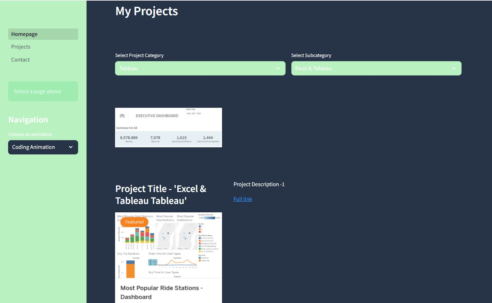
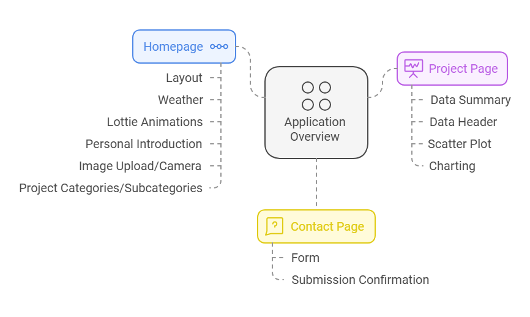
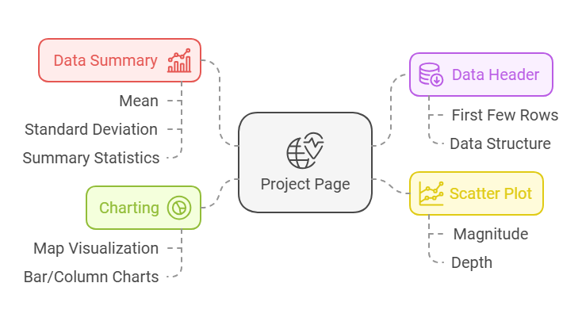
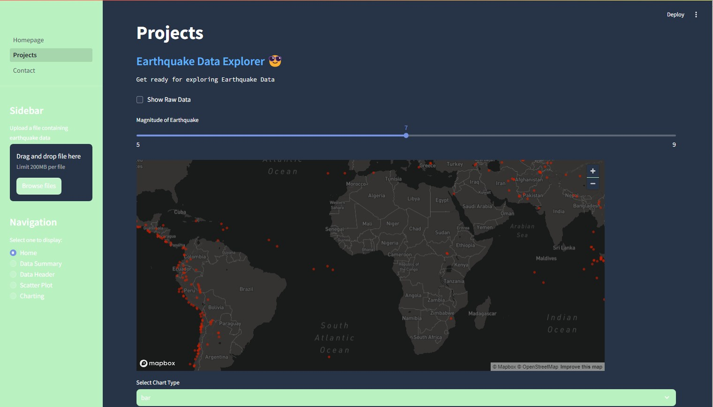
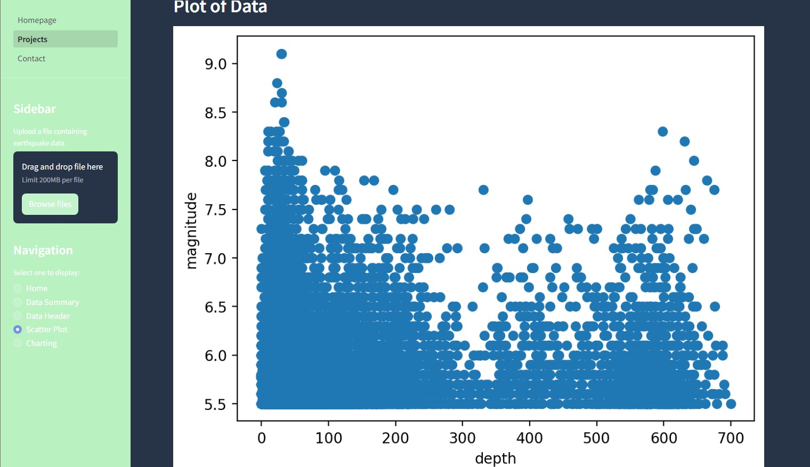

## 
👋 Hello, Welcome to my Application Project 👋  
<h3 align="center">'Streamlit Web Application' !</h3>

<h4 align="center">This Streamlit-based web application is designed to showcase interactive data visualization and analysis tools. The platform allows users to upload earthquake-related CSV files, explore dataset summaries, and generate insightful visualizations such as scatter plots, geographic maps, and statistical summaries. Its intuitive design enhances data accessibility and provides meaningful insights for decision-making.</h4>

  

  

Please scroll down to know more about this project

[Explore other projects »](https://github.com/paudel7?tab=repositories)

  <a href="your-demo-link">View Demo</a>
  ·
  <a href="your-bug-report-link">Report Bug</a>
  ·
  <a href="your-feature-request-link">Request Feature</a>

  
  
  

## 🎯 About The Project
For more details: 
<a href="https://sites.google.com/view/python-streamlit-web-app/home">Project Documentation Homepage</a> 
<a href="https://sites.google.com/view/python-streamlit-web-app/home/pages">Project Documentation Projectpage</a> 
<a href="https://mypyweb.streamlit.app/">View the application live</a>

**Application Structure**

  

This project is a web application built using Streamlit, a powerful Python framework for creating interactive web applications. The platform showcases a diverse set of features, including weather data, project displays, and personal information about the developer. The application is designed for ease of use and provides a rich, interactive user experience.

**Key Technologies Used**  
•	Streamlit: Front-end framework for building the app interface.
•	Python: Backend programming language.
•	Pandas, NumPy: For data manipulation and numerical operations.
•	Matplotlib: Used for visualizations and data representation.
•	Pillow: For image processing tasks.
•	Requests: To fetch external data via APIs.
•	Streamlit-Lottie: To integrate Lottie animations into the app.

 
**Core Features and Functionalities**
1.	Weather Information: Displays real-time weather updates (temperature and "feels like") based on the selected location, fetched from the OpenWeatherMap API [Explore OpenWeatherMap »](https://openweathermap.org/)
2.	Date & Time: Dynamic display of the current date and time.
3.	Lottie Animations: Interactive section for displaying animations that enhance the user interface.
4.	Project Showcase: Displays Kiran’s featured projects with categories and subcategories, allowing users to explore detailed descriptions.
5.	Image Upload/Camera Capture: Users can upload images or take photos using their device, which are displayed on the page.
6.	Contact Form: Enables users to contact Kiran directly through a simple, easy-to-use form.

## ✨ Demo-Preview

Here are some snapshots of the project:

**Project Page Structure**

 

 

 **Project Page**
 
  
 
 

 **Project Page**
 
  
 
 

 

<!-- ## ⚡ Workflow

<!--

  

NA at this moment

## 📚 References

  

NA at this moment

## 📋 Table of Contents 
[Demo-Preview](#-demo-preview)
- [Workflow](#-workflow)
- [References](#-references)
- [Installation](#-installation)
- [Usage](#-usage)
- [Contribute](#-contribute)
- [License](#-license)
- [Contact](#-contact)
- [Acknowledgments](#-acknowledgments)

## 🚀 Installation

Please follow the steps in the instruction text file.

(<a href="#-table-of-contents">back to top</a>)

## 💡 Usage

For more usage info, just take a look at the instruction text file.

(<a href="#-table-of-contents">back to top</a>)

## 🤝 Contribute

Contributions are what make the open source community such an amazing place to learn, inspire, and create. Any contributions you make are **greatly appreciated**.

1. Fork the Project
2. Create your Feature Branch (`git checkout -b feature/[FeatureName]`)
3. Commit your Changes (`git commit -m '[Your Commit Message]'`)
4. Push to the Branch (`git push origin feature/[FeatureName]`)
5. Open a Pull Request

(<a href="#-table-of-contents">back to top</a>)

## 📝 License

Distributed under the [License Type] License. See `LICENSE.txt` for more information.

(<a href="#-table-of-contents">back to top</a>)
 -->

## 📫 Contact

  
  
  

## 🛠️ Languages and Tools

  <!-- Add your tech stack icons here -->
  
  <!-- Add more tools as needed-->

## 🙏 Acknowledgments

Here is a list of some of the resources I found helpful and would like to give credit to:

---

<!-- 
(<a href="#-table-of-contents">back to top</a>)
 -->
<a href="https://sites.google.com/view/python-streamlit-web-app/home">For more pls. visit</a> 

---

If you found this project helpful, please consider giving it a ⭐!

